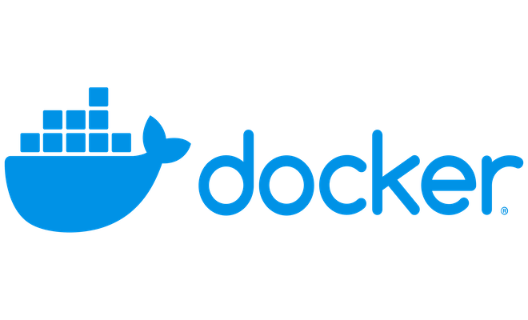

## What is Docker?
Docker의 기본적인 개념은, OS Level의 가상화 기술을 활용하여 container라는 패키지로 소프트웨어를 제공하는 PasS(Platform as a Service)의 모음입니다.

여기서 중요하게 볼 부분은 container 라는 부분입니다. docker의 log를 보면 고래가 정사각형 모양의 상자(컨테이너)를 싣고 있는 것을 볼 수 있는데요. 이 로고가 사실상 docker의 개념을 잘 표현하고 있습니다.

이 로고처럼 Docker(고래)는 경량화된 소프트웨어 패키지(container)를 모아서 사용자가 어떤 환경에서든지 동일한 경험이 가능하도록 해주고 있습니다. 그래서 Docker는 여러 환경에서의 배포 역시 매우 간단하게 만들어줍니다.

### containerization
Docker를 이해하기 위해서는 먼저 container를 이해해야 합니다. computing에서 container를 만드는 container화 즉 containerization은 여러 네트워크 리소스에 대한 OS-level 가상화 혹은 Application-level 가상화라고도 부릅니다.
이때, container의 가장 큰 특징이 두 가지가 있습니다. 첫 번째는 클라우드 뿐만 아니라 비클라우드에서도 환경에 상관이 없다는 점 입니다. 두 번째는 바로 독립적인(격리된) 환경에서 동작을 한다는 점 입니다.

1. 첫 번재 특징인 환경에 상관이 없다는 부분에 대해서 알아보겠습니다.

우리가 일상에서 컨테이너라고 하면 가장 먼저 떠오르는게 부두가에 쌓여있거나 화물선이나 트럭에 실려 운반되는 컨테이너가 떠오르실 겁니다. 이때 이 컨테이너들은 운송수단에 상관없이 자유롭게 실려 운반이 됩니다. 만일 어떤 컨테이너는 배에만 실릴 수 있고 어떤 컨테이너는 트럭으로만 운송이 가능하다면 매우 비 효율적이게 됩니다.
computing에서의 컨테이너도 동일합니다. 운송수단을 프로그램이 실행되는 서버라고 치환하시면 됩니다. 
특정 환경의 서버나 클라우드 공급 업체의 환경에서만 동작이 가능하다면 굳이 시간과 노력을 들여서 컨테이너를 만들 필요가 없을 것 입니다. 그냥 바로 실행하면 되니까요. 하지만 환경에 대한 제약이 없어진다면, 동일한 프로그램을 여러 환경에서 빠르게 배포하고 운영이 가능해지게 됩니다. 화물을 운반하는 컨테이너처럼 프로그램 이라는 하나의 package를 container화 시킨 container는 어떠한 환경에서도 동작이 가능하여 배포 및 운영이 매우 간편해지고 상황에 따른 운영 환경 변화에도 능동적으로 대응이 가능합니다.
만일 PM으로만 서비스 하던 중에 사용자가 늘어나 긴급하게 서버 증설이 필요한 경우, PM를 셋팅하기는 어려우니 클라우드 환경에 container화 된 프로그램을 배포하여 긴급으로 투입 할 수도 있을 것 입니다.

2. 두 번째 특징은 격리된 환경이라는 것 입니다.

격리된 환경이라는 것은 각각의 container가 서로 영향을 주지 않는다는 점 입니다. 이 역시 화물 컨테이너로 비유해보겠습니다. 배에는 여러개의 컨테이너가 실리게됩니다. 그리고 배의 목적은 실려있는 모든 컨테이너를 무사히 목적지의 항구로 운송하는 것 입니다. 이때 각각의 컨테이너는 주인도 다르고 안에 내용물도 다릅니다. 같은 배에 실리긴 했으나 서로 전혀 영향을 주지 않고 독립적이죠. 심지어 이 컨테이너들은 서로 다른 배에 실렸어도 전혀 문제가 되지 않았을 겁니다. 그저 목적지가 같다는 이유로 같이 실린겁니다.
computing에서의 container역시 동일합니다. 여러 목적을 지닌, 그리고 만들어진 주인과 출처가 각각 다릅니다. 그리고 서로 영향을 전혀 주지 않습니다. 하나의 목적, 즉 프로그램 실행에 필요하기 때문에 모이게 된 것 입니다.
제공자가 다르고 실행하는 내용이 다르지만 각기 다른 container들은 서로 전혀 영향을 주지 않고 격리된 환경에서 동작하게 됩니다.

이러한 특징을 가진것을 container라고 하며, 이는 docker에서 매우 핵심적인 개념입니다.

## Docker의 작동방식
Docker의 작동방식을 이해하기 위해서 가장 중요한 부분은 위에 설명한 container와 이미지 입니다. 이미지란 소프트웨어를 실행하는데 필요한 모든 것 즉 코드, 런타임, 드라이버, 도구, 스크립트 등이 포함됩니다.
Docker 컨테이너는 현재 실행중인 docker 이미지 인스턴스를 말합니다. 이때, docker 컨테이너는 VM과 다르게 호스트 운영체제 위에서 실행되게 됩니다.

위 그림과 같이 docker 이미지 내부에는 별도의 OS가 존재하지 않습니다. 동일한 호스트 OS위에서 여러 컨테이너화된 어플리케이션이 올라가고 실행되게 됩니다.
이렇기 때문에 같은 호스트 운영체제 위에 올라간 여러 docker들은 서로 동일한 resource를 활용하게 됩니다. 이는 VM보다 네트워크 성능이 좋아지는 이유가 됩니다.

위 이미지는 VM 방식을 보여주고 있습니다. docker와 다르게 VM은 서로 각각의 게스트 OS가 존재하게 됩니다. 하나의 PM에서 여러개의 VM을 띄우는 상황이라면 동일한 infrastructure이기는 하지만 Hypervisor를 통해서 가상화된 리소스를 받게되고 그 위에 독립적인 OS와 application이 실행됩니다.
즉, docker와 가장 큰 차이점은 VM은 각각 자신만의 OS를 가지게 된다는 점 입니다.

만일 다양한 종류의 OS를 하나의 장비에서 실행해야 하는 경우에는 VM이 적합할 수 있습니다. 하지만 동일한 OS환경이라면 VM보다는 docker가 같은 네트워크 리소르를 활용하기 때문에 서로 통신함에 있어서는 훨씬 빠르고 각각 OS를 포함하지 않고 Host의 OS를 공유하기 때문에 훨씬 가볍게 됩니다.

## Docker를 사용해야 하는 이유와 상황
그러면 Docker를 사용해야 하는 경우는 어떠한 상황이고 그 이유는 무엇일까요? 

1. 보다 더 많은 프로그램을 빠르게 제공

Docker의 가장 큰 특징은 환경에 구애받지 않는 다는 점 입니다. 그렇기 때문에 여러 고객사들에게 더 많은 프로그램을 더 빨리 제공 할 수 있습니다. 
또한 사내에서 협업을 하는 경우에도 유용하게 사용 할 수 있습니다. 하나의 프로그램을 여러 팀에서 활용하는 경우가 종종 있습니다. 이때 git을 통해 코드나 여러 os에 맞는 빌드된 파일을 공유하기 보다는 docker로 공유를 하게되면 보다 빠른 배포 및 서비스 적용이 가능합니다.
거기다 docker container는 서로 독립적이기 때문에 트러블 슈팅과 같이 이슈를 해결하는데에도 훨씬 수월하게 됩니다.

2. 원활한 운영 환경 이전

서비스를 운영하다보면 장비의 노후화 혹은 환경의 변화 등 여러 이슈로 운영 환경 이전이 필요합니다. 또한 트래픽 증가에 따른 서버 증설도 필요하고요. 이때 docker를 활용하면 이전 및 확장이 매우 편리합니다.
환경에 구애받지 않기 때문에 기존에 만들어둔 docker 이미지를 새로운 환경 혹은 증설한 장비에서 바로 실행하면 되기 때문에 매우 편리합니다.

3. 경량화를 통한 비용 절감
앞서 말씀드린 것 처럼 docker에는 os와 같은 인프라가 포함되어있지 않습니다. 즉, Docker이미지는 매우 가볍습니다. 그래서 하나의 장비(환경)에서 여러개의 docker container를 실행 시킬 수 있게되고 이는 곧바로 비용 절감으로 이어지게 됩니다.

지금까지 Docker에 대해서 간단하게 설명드려봤습니다. 정리하면 Docker는 다음과 같은 key point를 알아두시면 좋을 것 같아요.
1. 독립된 실행 환경
2. 클라우드던 비클라우드던, 그 공급자가 누구던 구애받지 않는 서버 환경
3. 서로의 통신이 VM대비 빠르고 가볍다는 장점
4. 원활하고 빠른 운영

실제로 저도 PM 및 VM에서 docker기반의 클라우드로 이전을 진행했는데요. 정말 제가 위에 설명드린 장점들을 몸소 경험했었습니다. 또한 docker만의 주의점과 단점도 물론 있었는데요. 이러한 내용은 이후에 하나하나 공유드리겠습니다.