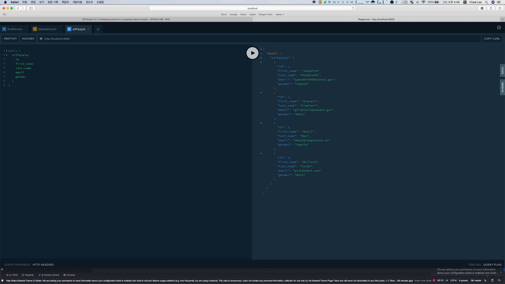

GraphQL을 이용하여 자신의 machine에 간단한 server를 직접 구축 해볼 수 있습니다. 이번 포스팅에서는 server를 구축하는 방법에 대해서 설명하겠습니다.
만일, GraphQL에 대해서 잘 모르시는 분은 [What is GraphQL](../graphql-what-is-graphql) 포스팅을 한번 보고 오시는 것을 추천합니다.
 
먼저, 본인의 장비에 GraphQL API server를 셋팅하기 위한 package가 설치 되어있는지 확인해야 합니다. 참고로, 저는 Mac 환경에서 개발을 하기 때문에, 모든 예제는 Mac을 기반으로 설명 하지만, 설치부분을 제외하면 linux 계열이기 때문에 동일합니다.
그러면 terminal에서 apollo-server graphql을 설치해줍니다.

~~~bash
npm install apollo-server graphql
~~~

그러면 여러분의 장비에 GraphQL을 service하기 위한 기본 server package는 다 설치가 된 것 입니다. 그러면 이제 하나하나씩 설정해 나가면 됩니다.

## Create Project
관리하기 편한 곳에 project directory를 생성하세요!! 저는 ~/sehee\_dev/graphql\_server\_ex 를 생성하였습니다.

~~~bash
mkdir ~/sehee_dev/graphql_server_ex
cd ~/sehee_dev/graphql_server_ex
~~~

그러고 난 뒤에, server의 main이 되는 index.js 파일을 생성해 줍니다.

~~~bash
touch index.js
~~~

기본이 되는 index.js까지 만들었으니, 이제는 초기화를 시켜줍니다. 초기화는 <strong>npm</strong>을 사용합니다.
~~~bash
npm init -y
~~~

초기화까지 끝나면, package.json 이라는 file이 생성됩니다.

## Design data schema, resolver
[What is GraphQL](../graphql-what-is-graphql) 포스팅에서 기본적으로 필요한 것이 schema와 resolver라고 했습니다. 이번에는 schema와 resolver를 각각 정의해 보겠습니다.
참고로, 본 예제에서 사용하는 sample data는 [git](https://github.com/sehee-lee/graphql_server_ex/blob/master/people.json)에 있습니다.

### schema
schema에 대한 js code file을 먼저 만들어 보겠습니다.
우리는 apollo에서 제공하는 GraphQL을 이용해서 서버를 만들기 때문에 이를 code에 넣어줘야 합니다.
~~~javascript
const { gql } = require('apollo-server');
~~~

그리고 sample data가 사람에 대한 정보이기 때문에, 이를 위한 type인 Person을 만들어 줍니다.
~~~javascript
    type Person {
        id: Int!
        first_name: String!
        last_name: String!
        email: String
        gender: String
        ip_address: String
    }
~~~

그 다음으로는, 이 data에 대한 query를 정의해줘야 하는데요, id를 통해서 특정 한명을 찾는 query와 모든 사람에 대한 정보를 찾는 query 두 개를 정의합니다.
~~~javascript
    type Query {
        findPerson(id: Int!): Person
        allPeople: [Person]
    }
~~~

마지막으로는 특정인의 정보를 지우는 mutation을 정의해 줍니다.
~~~javascript
    type Mutation {
        deletePerson(id: Int!): Boolean
    }
~~~

이렇게 정의하는 내용은 GraphQL에 대한 정보이기 때문에 최종적으로 typeDef.js file은 다음과 같습니다.
~~~javascript
const { gql } = require('apollo-server');

module.exports = gql`
    type Person {
        id: Int!
        first_name: String!
        last_name: String!
        email: String
        gender: String
        ip_address: String
    }

    type Query {
        findPerson(id: Int!): Person
        allPeople: [Person]
    }
    type Mutation {
        deletePerson(id: Int!): Boolean
    }
`;
~~~

### resolver
이번에는 각 query와 mutation이 들어왔을 때, 어떻게 동작할지 정의 부분이라고 할 수 있는 resolver를 작성합니다.
 
먼저 json file로 부터 data를 읽습니다.

~~~javascript
var people = require('./people.json');
~~~

이렇게 하면, people는 array가 됩니다. 그리고 여기에 담기는 object는 위에서 정의한 Person 구조체와 동일한 구조로 되어있습니다. 그 다음으로는 query에 대해서 먼저 작성합니다.
~~~javascript
Query: {
        findPerson: (parent, { id }) => {
            const person = people[id-1];
            if (person) {
                return person;
            } else {
                throw new Error('Not Found!');
            }
        },
        allPeople: (parent) => {
            return people;
        }
    }
~~~

다행이도... people.json file은 id별로 정렬 되어있습니다. 그래서 입력받은 id-1이 해당 id의 object가 있는 index가 됩니다. 그리고 모든 정보를 다 출력하는 allPeople의 경우는 그냥 array를 넘겨주면 됩니다.
 
query를 정의했으니, 이번에는 mutation을 정의해보겠습니다.
~~~javascript
Mutation: {
        deletePerson: (parent, { id }) => {
            const index = people.findIndex(person => person.id === id);
            if (index < 0) return false;
            people.splice(index, 1);
            return true;
        }
    }
~~~
people array에서 입력받은 id인 object에 대한 index를 찾아서 이를 삭제해주는 code입니다. 이렇게해서 만들어진 전체 resolver.js file은 다음과 같습니다.
~~~javascript
var people = require('./people.json');

module.exports = {
    Query: {
        findPerson: (parent, { id }) => {
            const person = people[id-1];
            if (person) {
                return person;
            } else {
                throw new Error('Not Found!');
            }
        },
        allPeople: (parent) => {
            return people;
        }
    },

    Mutation: {
        deletePerson: (parent, { id }) => {
            const index = people.findIndex(person => person.id === id);
            if (index < 0) return false;
            people.splice(index, 1);
            return true;
        }
    }
};
~~~

## Run server
이제 마지막으로, index.js에 server를 실행하기 위한 code를 넣어줍니다.
~~~javascript
const { ApolloServer, gql } = require('apollo-server');
const typeDefs = require('./typeDefs');
const resolvers = require('./resolvers');

const server = new ApolloServer({
    typeDefs,
    resolvers
});

server.listen().then(({ url }) => {
    console.log(`Listening at ${url}`);
});
~~~
이렇게해서 code 작성은 끝났습니다. 이번에 해줘야 하는 작업은, 실제로 server를 돌리는 작업입니다.
 
project directory로 이동하여, node 명렬어를 통해서 server를 실행시켜줍니다.
~~~bash
node . (or node index.js)
~~~
그러면 다음과 같은 message가 출력되며 server가 동작합니다.
~~~bash
Listening at http://localhost:4000/
~~~
그러면 safari나 chrome를 통해서 접속하면 다음과 같은 화면이 나오고, 여기서 query를 직접 전송해볼 수 있습니다.
  

  
간단하게 GraphQL API server를 생성하는 법을 알아봤습니다. 그리고 이 프로젝트에 대한 내용은 제 [git](https://github.com/sehee-lee/graphql_server_ex)에서 확인하실 수 있습니다.
다음 포스팅에서는 jest를 이용하여 GraphQL server를 test하는 방법에 대해서 posting 하겠습니다.

## Refernce
> [Apollo Server를 이용한 초간단 GraphQL 서버 개발](https://www.daleseo.com/graphql-apollo-server)