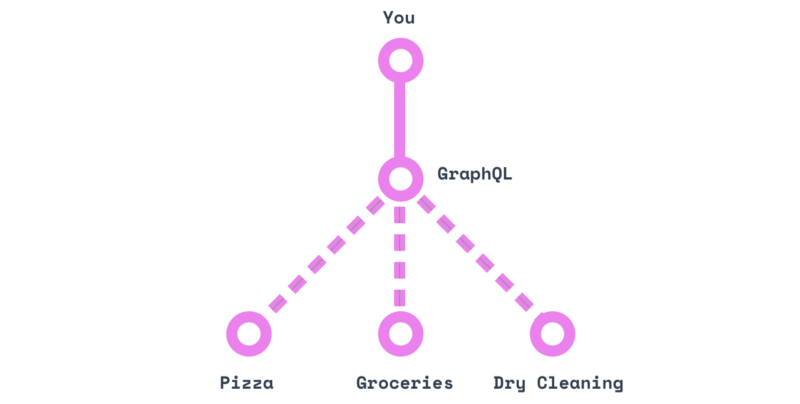
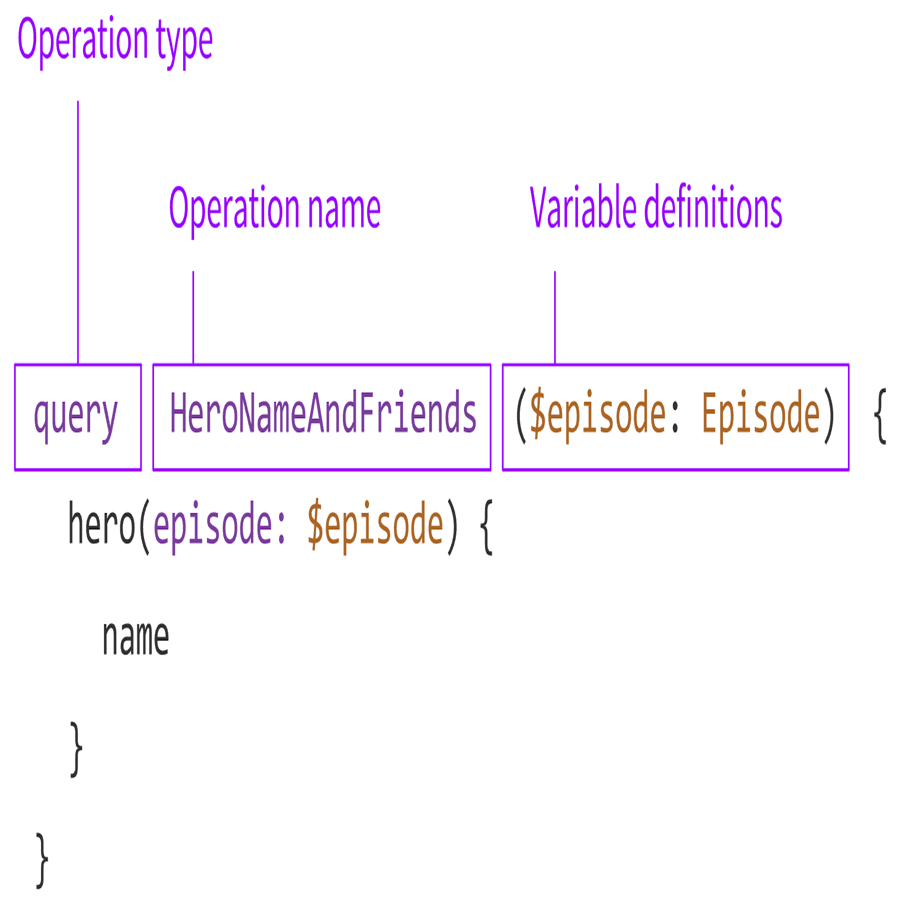

GraphQL은 <strong>How to ask flexibly for data to server?</strong> 라는 의문에서 시작되었다.
이러한 의문에서 시작 했기 때문에 query라는 것이 등장하였고, flexibly를 위해서 REST API와 같이 database와 플랫폼에 종속되지 않는 특징을 지니고 있다. 
이 포스트에서는 어떠한 경우에 GraphQL을 사용하며, 기존에 주로 사용되던 REST와 어떠한 차이점이 있는지 개념과 함께 정리한다.

## GraphQL?
GraphQL은 2012년에 Facebook이 개발하여 2015년에 공개적으로 발표한 data query이다. 현재(2019년 11월) 기준으로 GraphQL은 아직 early stage이다.
실제로 국내에서 얼마나 많은 API가 GraphQL API로 OPEN되어있는지..... 찾기도 어렵다.(아마 거의 없을 듯....) 해외의 경우도 [Github](https://developer.github.com/v4/)에서는 사용 한다고 하지만, 그 외에도 사용하는 곳은 매우 드물다. 
그럼에도 불구하고 전 세계적으로 GraphQL에 대한 관심이 매우 가파르게 올라가고있으며, 이를 도입하기 위한 노력도 계속되고 있다.
실제로 google에 GraphQL을 검색하면 벌써 sample project가 올라와 있다.(심지어 한국어로 설명된 sample project도 은근히 있다.) 그러면 왜 이렇게 GraphQL에 대한 관심이 늘어나고 있는 것 인가?

GraphQL은 다양한 언어로 구현되어있는 API들을 위한 data query이다. 현재 구현되어 있는 언어는 client는 apollo client, relay 등이 있고, 서버는 JavaScripts, Python, ruby, JAVA, C#, scala, go, PHP 등등... 현재 web service를 위해서 사용하는 대부분의 언어로 구현되어있다.
앞서, query라는 점에서 SQL과 GraphQL이 상당히 유사하다고 언급하였다. 이는 단순히 query라는 관점에서 유사하다는 것 이고, 실제로 이를 사용하는 관점에서의 구조와 방식에서는 상당한 차이를 보인다.
이러한 차이는 SQL은 database에서 정보를 가져오기 위한 목적으로 탄생한 query이고, GraphQL은 web client가 server로 부터 data를 가져오기 위한 목적이기 때문에 고려해야 하는 점이 다르다.
 
~~~SQL
SELECT TITLE, BODY, DATE, DOCID FROM COLLECTION;
~~~
> collection table에서 title, body, date, docid 값을 가져오는 SQL 예시
~~~
{
    document {
        TITLE
        BODY
        DATE
        DOCID
    }
}
~~~
> document라는 struct에 title, body, date, docid를 담아서 data를 가져오기 위한 GraphQL 예시

 
server side에서는 client로 부터 받은 GraphQL로 작성된 query를 받아서 처리한 다음에 이를 다시 client로 돌려준다. 
이때, HTTP API 자체가 특정 Database나 플랫폼에 종속 되어있지 않기 때문에 GraphQL역시 이것들에 종속되어있지 않다. 심지어 network 방식에도 종속되어 있지 않다고 한다.

## REST API와의 차이점
위에서 설명한 GraphQL을 보다보면 이젠 SQL이 아닌 REST API가 떠오르게 된다. REST API의 가장 큰 특징은 URL, METHOD를 조합해서 사용하고 그로 인해서 endpoint가 다양하게 존재한다는 점 이다.
그래서 request하는 url을 게속해서 만들어 줘야하고, 변경이 일어나면 매우 불편하다는 단점을 가지고 있다. 반면, GraphQL API의 경우에는 endpoint에 따라서 달라지는 것이 아니라 schema에 따라서 달라진다. 
예를들어, 피자집과 잡화점 그리고 세탁소에 대해 요청을 해야한다면, REST API는 각각 모두에 대한 전화번호를 알고선 해당 전화 번호로 전화를 걸어서 요구해야 한다. 모두 endpoint가 다르다.

반면 GraphQL의 경우에는 client는 오로지 하나의 endpoint만을 가지며, 여기에 필요한 내용을 query로 요청하면 그에 맞는 정보를 돌려준다. endpoint를 각각 따로 관리하고 요청할 필요가 없다.

그래서 REST API와 다르게 한번의 네트워크 호출로 여러 정보를 얻어 올 수 있다. 이를 가능하게 하기 위해서 GraphQL API는 <strong>schema, queries, resolvers</strong>으로 구성되어있다.

##GraphQL API 구조
### 1. Schema / Type
Schema란 GraphQL에서 data를 표현하는 방법이다. 사실 다른 곳 에서 사용하는 schema라는 개념과 큰 차이가 없다.
앞서 설명 한 것 처럼, GraphQL API는 endpoint가 하나이다. 그러다 보니 server에 요청할 수 있는 정확한 데이터 표현이 필요하다. 
그리고 어떤 필드를 선택할 수 있는지, 어떤 종류의 객체를 반활할 수 있는지 등 필요한 것들이 존재하는데, 이러한 것을 가능하게 해주기 위해서 schema가 필요하다.
모든 GraphQL service는 data들에 대한 완벽한 정의와 설명이 필요하고, 실제 수행 할 때, query가 들어오면 해당 schema에 대해 유효성 검사를 진행 한 후 실행된다.
GraphQL에서 schema 작성은 C/C++의 header를 작성하는 과정과 유사하다!!!! 이는 기존 programmer들은 쉽게 이해하고 사용할 수 있다. 

~~~
type document {
    title: String!
    BODY: String
    DATE: String
    comments: [comment]
    DOCID: Int!
}
~~~

C/C++에서 struct를 사용해본 경험을 봤을 때, 생각보다 어렵지 않고 직관적이다고 느껴진다. GraphQL에서 제공하는 type들은 매우 다양하다. 위 예시에 나와있는 String, Int 외에도 comment와 같이 직접 type을 define 할 수 있다.
추가로 알아둬야 할 것은 다음 두 가지이다.
- !: 필수 값(non-nullable)
- [, ]: array

그 외에는 [GraphQL schema type](https://graphql.org/learn/schema/)을 참고하면 좀 더 자세하게 나와있다.

### 2. Quries and Mutation
client가 GraphQL API를 사용하여 service는 하면, 대부분은 server로 부터 데이터를 단순하게 요청하는 경우가 많을 것 이다. 
이렇게 데이터를 단순하게 받기만  때에는 <strong>Query</strong>를 사용한다. 할
그런데 GraphQL에서는 굳이 query와 mutation이라는 개념을 따로 분리해서 사용한다. 이 둘의 큰 차이는 그 역할에 있다고 볼 수 있는데, query는 데이터를 읽기 위해서 사용한다면, 
mutation은 <strong>데이터를 변경(modify server-side data)</strong>하는데 사용된다.

#### Query
client는 server로 부터 데이터를 받기 위해서 "나 이런이런게 필요해!!"라고 전달해야 한다. 이 역시 서로 약속된 spec에 맞게 전달 해야하는데, 이를 query라고 한다. 
간단하게는 다음과 같다.

~~~
query { document }
~~~
document라는 struct의 모든 정보를 다 달라는 query를 이렇게 사용한다.
이렇게 질의를 날리게 되면, server는

~~~json
{ 
    "data": {
        "document": {
            "title": "What is GraphQL?"
            "body": "GraphQL is ...."
            "DATE": "2019-11-06"
            "DOCID": 1
        }
    }
}
~~~

이렇게 결과를 던져주게 된다. 

단순하게 이러한 형태의 query만 사용하면 쓰기에는 단순하지만, 사용성이 너무 떨어진다. 그래서 GraphQL은 이러한 일반 query와 함께 operation name query가 있다. 

operation name query를 이해하기 위해서는 operation name과 variable를 어떻게 사용하는지 그 쓰임을 보는것이 좋다. 
일반적으로, client는 절대로 static한 query만을 요청하지 않는다. id와 같은 parameter를 사용하여 요청할 것 이다. 
이를 위해서 GraphQL에는 variable라는 개념이 존재하고, 이를 이용하여 프로그래밍을 통해서 값을 할당 할 수 있게 함수 인터페이스도 존재한다.
또한 operation name을 지정하여 모호하지 않은 코드를 작성 할 수 있으며, 이를 통해서 server에 문제가 생기거나 client에서 문제가 생겨서 debugging을 해야 할 때, 매우 유용하다.
operation name query는 다음과 같이 사용한다.
~~~
query PostingNameAndDate($docid: Docid) {
  post(docid: docid) {
    title
    DATE
  }
}
~~~
이러한 query와 함께 다음 json data가 입력된다.
~~~json
{
  "docid": "1"
}
~~~
이렇게 요청하면 다음과 같은 결과를 server로 부터 받을 수 있다.
~~~json
{
  "data": {
    "post": {
      "title": "What is GraphQL?",
      "DATE": "2019-11-06"
    }
  }
}
~~~

operation name query는 다음과 같은 구조로 되어있다.

이렇게 variable 기능을 활용한 구문은 재사용성이 매우 높아서 한번 만들어 두면 여러 곳에서 유연하게 사용이 가능하다. 

물론, 이 variable는 default value를 사용할 수 이다.
~~~
query PostingNameAndDate($docid: ID = "1") {
   post(DOCID: $docid) {
     title
     DATE
   }
 }
~~~
이렇게 하게되면 기본으로 1번 docid의 posting의 정보를 전달해 주고, variable에 값이 있으면 해당 값의 posting을 전달해 준다. 

operation name query는 매우 편리하다. query용 함수이기 때문에 일반 개발자들이 처음 접해서 사용하기 까지의 허들이 낮고, 한번의 network 왕복으로 원하는 모든 데이터를 가져올 수 있다.
이로 인해서 front-end 개발자와 back-end 개발자간의 협업도 수월해진다. front-end 개발자는 server의 request/response의 형식에 매우 의존적이다.
하지만 GraphQL을 사용하면 이 부분에서는 자유롭다. 다만, schema에 대한 생각은 함께 해야하지만, database와 같은 곳에 일정한 형태로 이미 저장 되어있을 것 이기 때문에 사실 이것도 엄청나게 불편한 이슈는 아니다. 

### 3. Resolvers
GraphQL의 query를 parsing하는 대부분은 GraphQL library에 구현되어있다. 안타깝게도...... GraphQL에서 데이터를 가져오는 부분(<strong>Resolver</strong>)은 직접 구현해야한다.....
resolver를 직접 구현하는 것이 상당한 부담이기 하지만, 이를 구현해두면 source의 종류에 상관없이 사용이 가능하다. 즉, data를 database에서 가져올 수 있고 그냥 파일에서도 가져올 수 있다. 심지어 다른 network protocol을 통해서도 가져올 수 있다. 
이러한 resolver는 query가 돌아갈 때 작동하는 함수이며, 추상적으로 구현된 schema와 server의 기능을 query가 돌아갈 때 작동하는 하는 함수이다. 

앞에서 알아본 query를 작성한 후 이를 던지면, 다음 순서로 동작하게 된다. 

1. Parse: query를 parser가 이를 parsing하게 된다. 이때 [Abstract syntax tree](https://en.wikipedia.org/wiki/Abstract_syntax_tree)로 분석이 되며, 이렇게 분석된 query는 다음 단계로 넘어가게된다.
2. Validate: 1번에서 만들어진 AST를 가지고선, 이제 schema를 특정한다. user가 작성한 query가 적합한지 이 단계에서 check한다.
3. Execute: parsing도 했고 올바른 query임을 확인도 했으면 이제 실행을 한다!! AST의 root부터 타고 내려가며 query를 요청한 user에게 돌려줄 result를 json으로 collect하게 된다.

이때 들어온 query의 각각의 filed마다 함수가 하나씩 존재하게되고 이 함수는 다음 type을 돌려준다. 이때 type이 scala이면 종료한다!! 그리고 여기서 사용한 함수가 바로 resolver이다.
즉, type이 scala이면 resolver가 필요없이 바로 그 type을 쓰면 되지만, 그렇지 아닌 우리가 정의한 type이면 해당 type의 resolver가 호출된다. 

위에서 AST를 만들고 이를 root에서부터 타고 내려가며 수행한다고했다. 즉, root에서부터 내려가며 rosolver를 수행하게 된다.
예를들어, 다음과 같은 query가 들어왔을 때,

~~~
query {
    user {
        name
        email
    }
    album {
        title
    }
}
~~~

root는 user가 되고, 그 아래 child-node는 user와 album이 된다. 이 두 type은 scala type이 아니기 때문에 user와 album에 대한 resolver를 호출해서 다음으로 내려가야 한다. 그런데 name, email, title 모두 string이면 그냥 resolved가 되기 때문에 여기서 끝이난다.
GraphQL은 이렇게 query로 요청한 데이터를 parsing 한 후 이를 resolve하여 data를 collect한다.

##결론
보통 새로운 기술이 소개되면 가장 중요하게 생각하는 것은 성능이다. 물론 GraphQL의 가장 큰 장점 중 하나가 바로 성능이다. 하지만 여러 blog에서도 말하고 있는 것 처럼 GraphQL의 가장 큰 장점은 개발을 좀 더 효율적으로 할 수 있다는 것 이다.
데이터를 주고 받는 형식이 변경됨에 따라서 front-end 개발자와 back-end 개발자 간의 협업하는 문화도 많이 달라질 것 이다. 그런 점에서 GraphQL은 상당한 매력을 지니고 있다. 지금 당장 도입을 하는 것은 어려워도... 한번쯤 테스트로 시도해보며 전환을 고려해보면 어떨까 하는 생각이든다. 

##Reference
>[The Anatomy of a GraphQL Query](https://blog.apollographql.com/the-anatomy-of-a-graphql-query-6dffa9e9e747) 
>[GraphQL 개념잡기](https://tech.kakao.com/2019/08/01/graphql-basic/) 
>[Introduction to GraphQL](https://graphql.org/learn/)