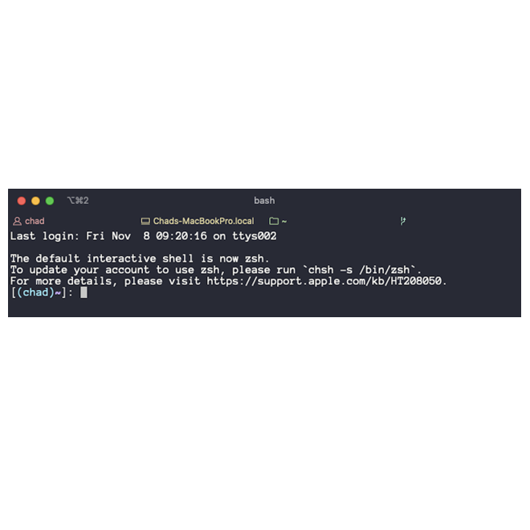

The default shell was changed to <strong>zsh</strong> in new Mac OS Catalina(10.15).
In case of me, using my Mac in work. So all of my shell setting for developing don't work anymore in Catalina.
Of course, developers who have already used zsh have no problem. And you can easily change default shell from zsh to bash in Caralina.
If you want to know how to change default shell in mac, visit [this](../mac-change-shell) page. However, if you change the default shell to bash, you should always faced below message.

I decided to use zsh, because this message is very annoying 😕 and zsh is very useful for development.(Beautiful command theme is also a big reason for this decision.)
Before descause about detail of zsh, you should know that zsh config file is <strong>.zshrc</strong>!!

## Theme
I did write that one of import reasons of using zsh is beautiful command theme. Now, I explain how to set theme and improve your environment for developing.

### 1. install oh-my-zsh
First step is installing oh-my-zsh. You can install oh-my-zsh by using two ways, curl and wget.
#### via curl
~~~bash
sh -c "$(curl -fsSL https://raw.githubusercontent.com/robbyrussell/oh-my-zsh/master/tools/install.sh)"
~~~
#### via wget
~~~bash
sh -c "$(wget -O- https://raw.githubusercontent.com/robbyrussell/oh-my-zsh/master/tools/install.sh)"
~~~

After that, directory for oh-my-zsh is created at $HOME/.oh-my-zsh.

### 2. set zsh theme
Now, you set theme at zsh. The list of zsh theme is listed at [oh-my-zsh themes github](https://github.com/robbyrussell/oh-my-zsh/wiki/External-themes).
After you found the name of favorite theme in the list, write down name at the config file which is .zshrc.
Since .zshrc is located at $HOME, edit this file using vim.
~~~bash
vi ~/.zshrc
~~~
Then, you can see <strong>ZSH\_THEME=</strong> phrase. Write down the name of theme after "=" like this ZSH\_THEME="sorin".
~~~
# Set name of the theme to load --- if set to "random", it will
# load a random theme each time oh-my-zsh is loaded, in which case,
# to know which specific one was loaded, run: echo $RANDOM_THEME
# See https://github.com/robbyrussell/oh-my-zsh/wiki/Themes
ZSH_THEME="sorin"
~~~
If you cannot chose only one theme, write down "random". This changes the theme each time you run it.

### 3. change font
Some themes are needed special characters for display information. Therefore if your terminal display "?" not emoji, should change font.
Down [powerline fonts](https://github.com/powerline/fonts) and then setting font at your terminal app(like iTerm). 
If change font,

to

## Plugin
The attractive points of zsh is that support plugin and there are very useful plugins.

### plugin location
I think you already installed oh-my-zsh. Then, zsh plugin is located at 
~~~bash
$HOME/.oh-my-zsh/custom/plugins/PLUGIN_NAME.
~~~
Otherwise, you do not use oh-my-zsh, zsh plugin is located at 
~~~bash
$ZSH_CUSTOM/plugins/PLUGIN_NAME.
~~~

### install plugin
Install plugin is very simple.
1. Download plugin from git or other site.
2. Move downloaded directory to plugin directory.

~~~bash
git clone https://github.com/zsh-users/zsh-autosuggestions ~/.oh-my-zsh/custom/plugins/zsh-autosuggestions
~~~

### edit config file
After download plugin at zsh plugin location, you should edit config file(.zshrc) for using plugin. 
First, open .zshrc file
~~~bash
vi ~/.zshrc
~~~
Second, add plugin information.
~~~
plugins=(autojump)
~~~

When restart terminal, you can use new plugin.

## My plugins
1. [autojump](https://github.com/wting/autojump)
~~~bash
brew install autojump
~~~
2. [autosuggestions](https://github.com/zsh-users/zsh-autosuggestions)
~~~bash
git clone https://github.com/zsh-users/zsh-autosuggestions ${ZSH_CUSTOM:-~/.oh-my-zsh/custom}/plugins/zsh-autosuggestions
~~~
3. [syntax highlighting](https://github.com/zsh-users/zsh-syntax-highlighting)
~~~bash
git clone https://github.com/zsh-users/zsh-syntax-highlighting.git
echo "source ${(q-)PWD}/zsh-syntax-highlighting/zsh-syntax-highlighting.zsh" >> ${ZDOTDIR:-$HOME}/.zshrc
~~~