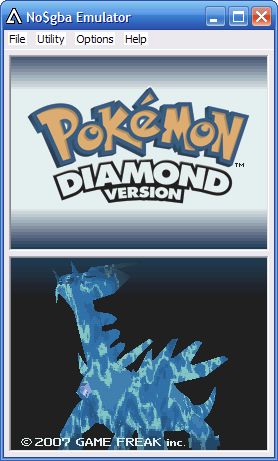
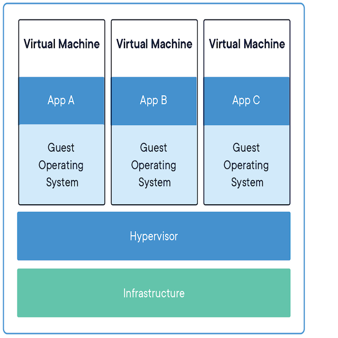
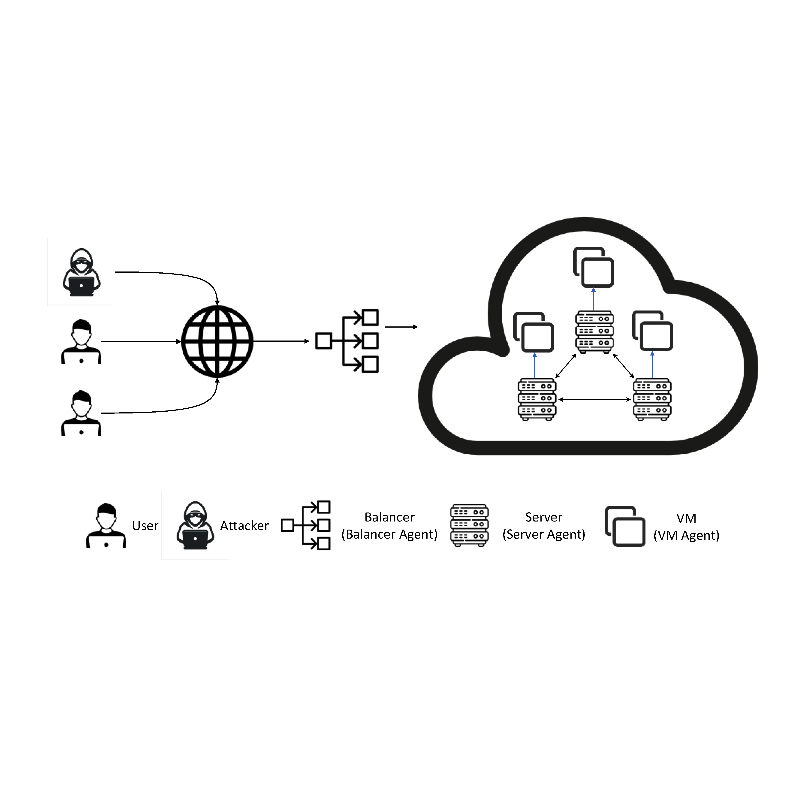
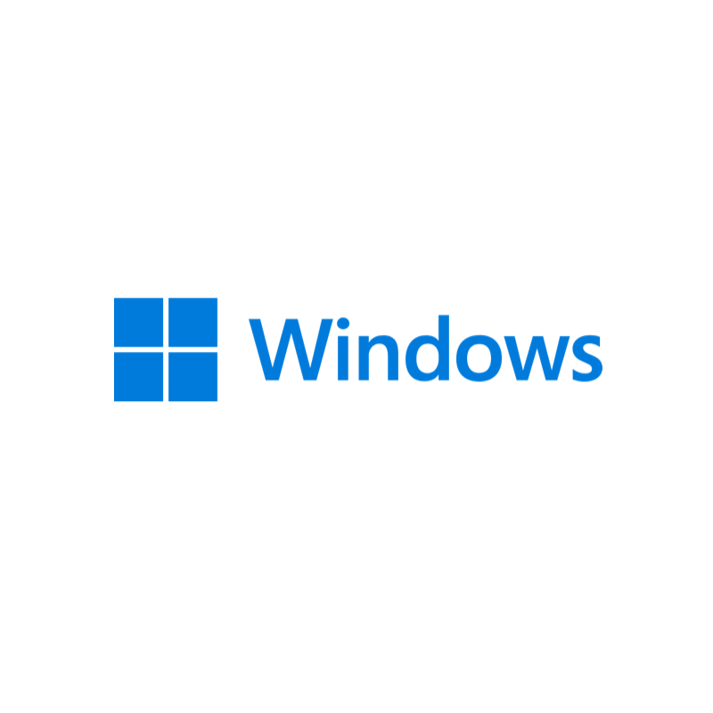
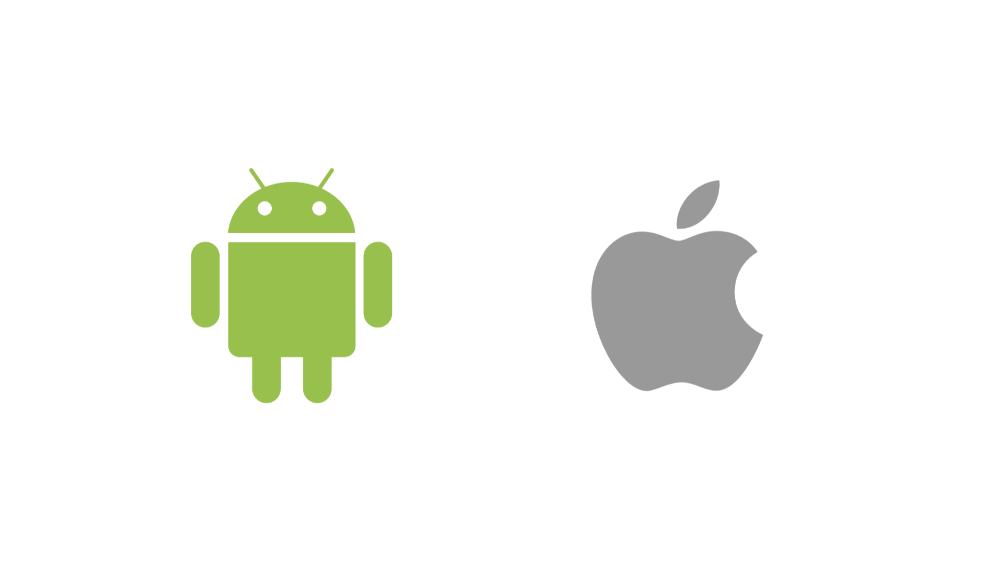

## What is VM(Virtual Machine)?
Virtual Machine, 줄여서 주로 VM이라고 표현하고 한국어로는 가상머신이라고 말합니다. 단어 그대로 "가상"으로 만들어진 "장비"로 PM(Physical Machine)와 주로 비교됩니다. 그렇다고 반대되는 개념은 아닙니다.
VM은 PM을 가상화 한 것 입니다. 한국에서 애플사의 맥 제품을 사용하신 분이라면 windows를 parallels라는 프로그램을 이용해서 사용하신 경험이 있을 것 입니다.
이때 parallels를 통해서 설치된 windows가 vm입니다. VM은 PM위에 가상의 컴퓨팅 환경을 그대로 구현한 것으로 사용함과 그 구성에 있어서 VM과 PM은 큰 차이가 없습니다.
또한 이러한 VM은 클라우드 서비스에 기본이 되게 됩니다. 클라우드 서비스 제공자들은 사용자에게 실제 PM을 대여해 주는 것이 아닌 VM을 제공하게됩니다.

불과 몇년 전 까지만 해도 클라우드 환경에서는 대량의 데이터와 트래픽을 처리하기 어렵다는 한계가 있었습니다. 그러나 현대에 들어서 이러한 한계가 많이 극복됨으로 인해 더욱 더 많은 서비스들이 클라우드 환경에서 제공되고 있습니다.
심지어 머신러닝, AI 등 컴퓨팅 파워가 필수인 분야에서도 VM을 활용한 클라우드를 사용하기 시작했습니다. 클라우드 환경의 장점은 여러가지가 있는데요. 이러한 장점들 모두 VM의 장점에서 출발하기 때문에 VM에 대한 기본적인 내용은 간단하게라도 알아두면 좋습니다.

## How to work VM
vm에 대한 기본적인 개념은 사실 어렵지는 않습니다. 우리는 pm에 매우 익숙하기 때문에 이러한 pm이 가상화 되었다는 것으로 생각하면 됩니다. 컴퓨터에서 에뮬레이터를 통해서 포몬을 비롯한 오래된 게임을 해본 적 있을텐데요. 이 역시 vm이라고 볼 수 있습니다.
게임기라는 물리 장비(pm)을 가상화 하여 다른 pm위에서 실행한 가상 장비(vm)가 되어 사용이 가능해진 것 입니다.

그럼 이런 가상화 장비(vm)은 어떻게 동작하게 될까요? 아래 그림을 한번 보고 가겠습니다.

위 그림은 하나의 pm위에 총 3개의 vm이 올라가 있는 것을 표현하고 있습니다. 장비가 하나이기 때문에 당연히 네트워크를 비롯한 물리적인 infra는 동일합니다. cpu, memory, disk 등 모든 인프라를 공유하게 됩니다.
그 위에 Hypervisor가 올라가게 됩니다. 이 Hypervisor는 여러 운영체제가 동작하도록 하는 하나의 플랫폼입니다. 즉, 하나의 pm위에 windows, linux, aix 등 여러 os의 vm이 올라갈 수 있도록 도와주는게 이 Hypervisor입니다.
사실 vm에 있어서 가장 중요한 부분이기 때문에 이를 VMM(Virtual Machine Manager, Virtual Machine Monitor)라고 불립니다. 이러한 Hypervisor위에 다양한 vm이 올라가게 됩니다.

각각의 VM들은 기본적으로 서로 독립적 입니다. 그리고 서로 다른 운영체제로 동작하는 것도 가능합니다. pm의 운영체제에 종속되지 않고 동작이 됩니다.
이 경우 궁금점이 생기게 됩니다. cpu, memory 등을 공유하게되는데, 이를 과연 어떻게 나눠서 사용하게 되는지 말이죠. 이때 중요하게 봐야하는 부분은 vCPU입니다. 
vCPU는 가상 CPU core를 의미합니다. 실제 물리 CPU의 core를 하이퍼스레딩 기술로 나눈 것을 말하는데요. vm의 경우에는 이렇게 실제 cpu core를 배정하는것이 아닌 vCPU를 제공하게됩니다.
memory역시 vm의 os에 맞춰 적절한 memory공간이 할당되는데요. 이때는 Hypervisor에 의해서 독립적인 memory공간을 제공받게 됩니다. vCPU와 memory등은 vm 제공 프로그램에 따라서 그 방식이 다릅니다.
클라우드 제공자의 경우에는 이러한 vCPU와 memory를 통해서 과금을 하고있습니다.

## vm을 사용하는 경우
vm은 다양한 분야에서 적극적으로 사용하고 있습니다. 실제로 소규모 기업에서는 아마존, 구글, MS 등 여러 클라우드 서비스에서 vm을 할당받아 사용하고있는데요. 그러면 pm보다 vm이 더 적합한 경우는 어떠한 경우인지 한번 알아보겠습니다.

### cloud computing

사실 최근에 vm을 가장 많이 사용하는 분야입니다. 클라우드 컴퓨팅의 기본은 사용자에게 지속 가능한 컴퓨팅 환경을 제공함에 있는데요. 이때 사용자는 제공받은 장비의 spec을 조절할 수 있으며 어떠한 물리적인 system으로 구성되어있는지 알 필요가 없습니다.
이때 vm을 적극적으로 활용합니다. vm은 클라우드 컴퓨팅에서의 가장 기본적인 단위이며 vm이 없으면 사실상 클라우드 역시 없었을 것 입니다. 
클라우드 서비스 제공자들은 여러 pm을 IDC에 셋팅해두고 자체 Hypervisor 및 여러 운영 플랫폼을 설정하여 사용자게에 딱 필요한 만큼의 컴퓨터를 vm으로 제공해줍니다.

### 다양한 OS 혹은 새로운 version의 OS에서의 test
개발을 하다보면 여러 환경에 소프트웨어가 잘 동작하는지 확인이 필요합니다. 하지만 모든 장비를 테스트를 위해서 갖추기에는 상당히 많은 비용이 들게되는데요. 이때 모든 os에 맞는 장비를 구축하기 보다는 필요한 os의 vm을 통해서 사용하면 많은 비용을 아낄 수 있습니다.

### 악성 프로그램 조사
악성 프로그램을 main pm에서 테스트 하고 조사하기에는 상당한 위험이 따릅니다. 자칫 다른 컴퓨터로까지 전파가 될 수 있으니까요. 이때 vm을 활요하기도 합니다. 또한 이러한 악성 프로그램이 새로운 시스템에서 어떠한 영향을 미치는지 연구가 필요하기도 한데요. 이때도 vm을 적극 활용하게 됩니다.

이렇듯 vm은 내가 직접 pm을 소유하고 운영하기에 부담이 되는 경우, 그리고 새로운 혹은 다른 os가 설치된 시스템이 필요한 경우에 적극적으로 활용하게 됩니다.

## VM의 유형
기본적인 개념과 사용 case에 대해서 알아봤는데요. 이번에는 몇몇 vm의 유형에 대해서 알아보겠습니다.

### windows vm

우리의 삶에 있어서 windows는 정말 필수적인 os입니다. 특히 대한민국에서는 없으면 불편한 일이 너무나 많습니다. 그렇기 때문에 대부분의 Hypervisor는 windows os를 기본으로 지원하고 있습니다.
특히 mac을 사용하시는 분들은 여러 플랫폼을 이용하여 windows 가상환경을 구성하여 사용하고 있습니다.

### Android & iOS

스마트폰이 전세계적으로 보급이되고 이 스마트폰에서 동작하는 app이 컴퓨터에서 동작하는 app 만큼이나 중요해졌습니다. 그로 인해 이러한 모바일용 app 개발이 활발해 졌는데요. 개발 하면서 확인을 하기위해 매번 실제 스마트폰에 직접 설치하고 확인하기는 너무 번거롭습니다.
이러한 과정을 좀 더 편하게 하기 위해서 가상 환경을 제공하고있습니다. 어플리케이션 개발자들은 자신의 컴퓨터에서 안드로이드 혹은 아이폰용 app을 해당 vm에 바로바로 적용하면서 편하게 개발이 가능해졌습니다.

### java 가상머신
java는 한곳에서 만들어진 코드를 여러 곳에서 바로 실행이 가능하게 한다는 기본적인 특징을 지니고 있습니다. 즉, mac 환경에서 작성된 java 코드가 linux, winodws 등의 환경에서도 동작이 가능해야하는데요. 이를 가능하게 하는것인 java 가상환경, 즉 JVM이라는 것 덕분입니다.
일반적인 C/C++, GoLang과 같은 코드로 작성된 프로그램은 빌드된 장비의 특성에 맞게 바이너리가 생성됩니다. 반면 java 프로그램은 이 JVM이라는 것을 위해서 만들어지게 됩니다. 즉 장비가 아닌 JVM에 맞게 생성이 됩니다.
그리고 이 JVM은 최하위 level인 machine에 맞게 변환하여 실제로 해당 프로그램이 동작하게 만들어 줍니다. 이때 JVM은 다른 VM과는 다르게 OS를 포함하지 않으며 Hypervisor를 사용하지 않습니다. 대신에 JVM은 특정 OS에서 실행이 가능하도록 어플리케이션 level의 프로그램으로 변환합니다.
그래서 OS별로 JVM이 따로 존재하고 각 OS에 맞는 JVM을 설치해야 정상적인 java 프로그램을 실행 할 수 있습니다.

이러한 구조는 한번 만들어진 java 프로그램이 os 및 실행 machine에 상관없이 JVM을 통해서 동작 가능하도록 만들어 줍니다.

### Python 가상머신
Python 가상머신은 Java 가상머신과 동일한 개념입니다. java 가상머신처럼 Python 가상머신 역시 OS를 포함하지 않으며 Hypervisor를 사용하지 않습니다.
Python VM은 Python language로 만들어진 코드를 여러 CPU에서 동작하도록 만들어 줍니다.

java와 유사하게 Python역시 바이트 코드라는 중간 형태로 변환됩니다. 그리고 이러한 프로그램이 실행되면 Python VM은 이를 해당 machine에 맞는 코드로 변경하여 프로그램을 실행하게 됩니다.
이 덕분에 java처럼 python역시 한번 작성한 code를 여러 환경에서 동작하게 할 수 있습니다.